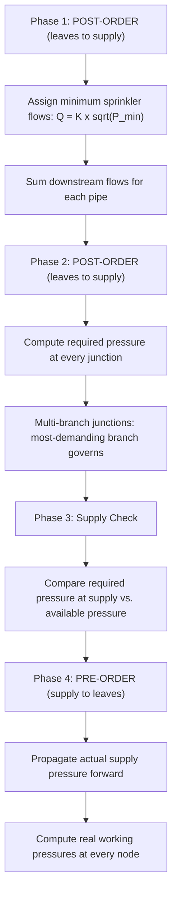
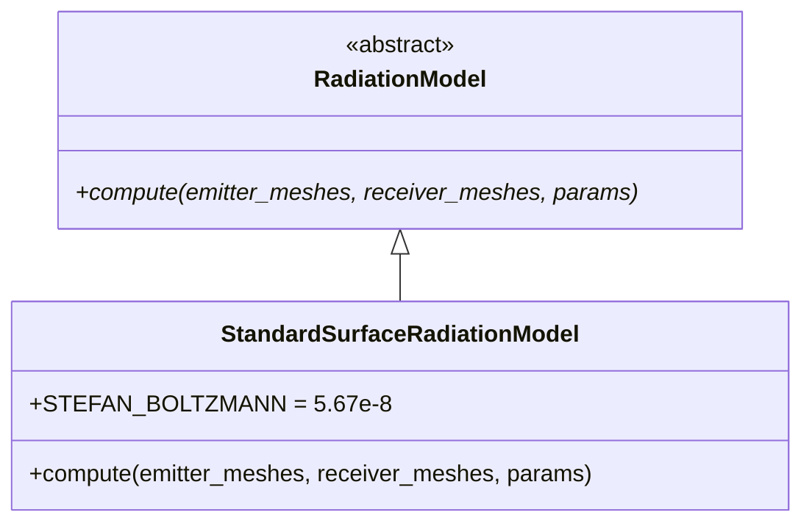

# Analysis Subsystems

**Key files:**

- `firepro3d/hydraulic_solver.py` -- Hazen-Williams pipe network analysis
- `firepro3d/hydraulic_report.py` -- Formatted hydraulic calculation report
- `firepro3d/thermal_radiation_solver.py` -- Surface-to-surface radiation analysis
- `firepro3d/thermal_radiation_report.py` -- Radiation analysis report
- `firepro3d/fire_curves.py` -- Standard fire temperature-time curves
- `firepro3d/constants.py` -- Velocity thresholds, NFPA 13 coverage limits

## Hydraulic Solver

### Purpose

Performs Hazen-Williams sequential pipe-by-pipe hydraulic analysis for tree-topology fire suppression networks per NFPA 13.

### Algorithm

The solver operates on tree/radial networks (no loops) in four phases:



### Key formulas (NFPA 13 Section 22.4.2)

| Formula | Expression | Units |
|---------|-----------|-------|
| Friction loss | `hf = 4.52 * Q^1.852 / (C^1.852 * d^4.87) * L` | psi |
| Elevation head | `h_e = 0.433 * dz` | psi (dz in ft) |
| Sprinkler flow | `Q = K * sqrt(P)` | gpm |
| Velocity | `v = Q * 0.4085 / d^2` | fps (d in inches) |

Where:
- `Q` = flow in gallons per minute
- `C` = Hazen-Williams roughness coefficient (default 120)
- `d` = pipe inner diameter in inches (from schedule lookup tables in `Pipe.INNER_DIAMETER_IN`)
- `L` = equivalent pipe length in feet
- `K` = sprinkler K-factor

### Input requirements

- A placed `WaterSupply` node connected to the pipe network
- At least one sprinkler in the design area
- Tree topology from supply to all sprinklers (no loops)

The solver uses `ScaleManager` to convert scene-pixel pipe lengths to real-world feet.

### HydraulicResult

```python
@dataclass
class HydraulicResult:
    node_pressures:     dict   # Node  -> float (psi)
    pipe_flows:         dict   # Pipe  -> float (gpm)
    pipe_velocity:      dict   # Pipe  -> float (fps)
    pipe_friction_loss: dict   # Pipe  -> float (psi)
    total_demand:       float  # gpm at supply connection
    required_pressure:  float  # psi required at supply node
    supply_pressure:    float  # psi available from supply curve
    passed:             bool   # True if supply >= required
    messages:           list   # warnings, errors, summary
    node_numbers:       dict   # Node  -> int (BFS order)
    node_labels:        dict   # Node  -> str ("1", "2", "3a", ...)
```

After solving, the result is stored on `Model_Space.hydraulic_result` and used by:
- The hydraulic report generator
- Pipe colour-coding by velocity (green/orange/red)
- Hydraulic badges displayed on nodes

### Velocity thresholds

Defined in `constants.py`:

| Threshold | Value | Colour | Meaning |
|-----------|-------|--------|---------|
| OK | < 12 fps | Green `(0, 200, 80)` | Normal flow |
| Warning | 12-20 fps | Orange `(220, 140, 0)` | Approaching NFPA limit |
| High | > 20 fps | Red `(220, 0, 0)` | Exceeds NFPA limits |

### Report generation

`hydraulic_report.py` generates a formatted calculation report from `HydraulicResult`, showing:
- Node-by-node pressure and flow tables
- Pipe friction loss details
- Supply vs. demand summary
- Pass/fail determination

## Thermal Radiation Solver

### Purpose

Evaluates radiative heat transfer between building surfaces using a surface-to-surface Stefan-Boltzmann model with geometric view factors. Used for fire separation distance analysis per NFPA and building code requirements.

### Architecture

The radiation system uses an abstract base class for extensibility:



The `StandardSurfaceRadiationModel` implements view-factor based Stefan-Boltzmann radiation calculation.

### Workflow

1. User selects emitter surfaces (fire-exposed walls) and receiver surfaces
2. `extract_surface_mesh()` calls `entity.get_3d_mesh()` on each selected entity (walls, roofs, floors)
3. Meshes are converted to vertices + faces arrays using numpy
4. The radiation model computes view factors between all emitter-receiver face pairs
5. Heat flux is calculated per receiver face
6. Results are compared against the performance threshold (default 12.5 kW/m^2)

### RadiationResult

```python
@dataclass
class RadiationResult:
    per_receiver_mesh:         dict   # entity -> {vertices, faces}
    per_receiver_flux:         dict   # entity -> ndarray of heat flux per face (kW/m^2)
    per_receiver_centroid:     dict   # entity -> ndarray (Mx3) centroids
    per_emitter_contribution:  dict   # entity -> float total contribution
    max_radiation:             float  # peak flux on any receiver cell
    max_location:              ndarray # 3D coordinates of peak
    area_exceeding:            float  # receiver area above threshold (m^2)
    total_receiver_area:       float  # total receiver area (m^2)
    threshold:                 float  # performance criterion (kW/m^2)
    passed:                    bool   # True if max < threshold
    messages:                  list
    parameters:                dict   # copy of input parameters
```

### Fire curves

`fire_curves.py` provides standard temperature-time curves used as input boundary conditions:

- **ISO 834** -- international standard fire curve
- **CAN/ULC S101** -- Canadian standard fire test
- **Constant temperature** -- user-defined steady-state temperature

## NFPA 13 constants

Coverage limits per hazard class (from `constants.py`):

| Hazard Class | Max Coverage (sq ft) |
|-------------|---------------------|
| Light Hazard | 225 |
| Ordinary Hazard Group 1 | 130 |
| Ordinary Hazard Group 2 | 130 |
| Extra Hazard Group 1 | 100 |
| Extra Hazard Group 2 | 100 |
| Miscellaneous Storage | 100 |
| High Piled Storage | 100 |

These limits are used by `Room` entities to validate sprinkler coverage and by the auto-populate algorithm to place sprinklers within allowable spacing.

## Connection to other subsystems

- **Model_Space** stores `hydraulic_result` and triggers solver runs
- **SprinklerSystem** provides the node/pipe/sprinkler network graph
- **ScaleManager** converts scene dimensions to real-world units for calculations
- **LevelManager** provides elevation data for 3D mesh extraction and elevation head calculations
- **Entities** (Node, Pipe, Sprinkler) store K-factors, diameters, C-factors, and pipe schedules used by the solver
- **3D View** can visualize radiation heat maps on receiver surfaces
