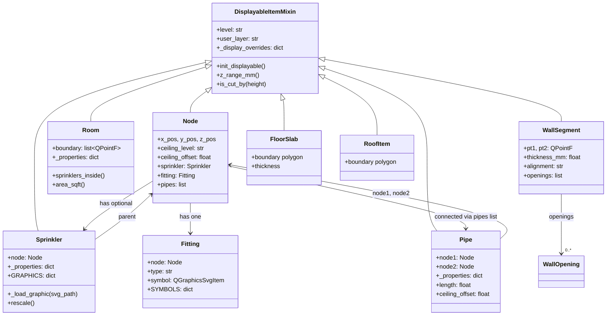

# Entity System

**Key files:**

- `firepro3d/displayable_item.py` -- Mixin providing display-manager attributes
- `firepro3d/node.py` -- Junction points in the piping network (330 lines)
- `firepro3d/pipe.py` -- Pipe segments connecting nodes (671 lines)
- `firepro3d/sprinkler.py` -- SVG-based sprinkler symbols (165 lines)
- `firepro3d/fitting.py` -- Pipe fittings: elbows, tees, caps (429 lines)
- `firepro3d/room.py` -- Polygonal room/space regions (540 lines)
- `firepro3d/wall.py` -- Wall segments with thickness and openings (1,028 lines)
- `firepro3d/floor_slab.py` -- Floor slab polygons
- `firepro3d/roof.py` -- Roof polygons
- `firepro3d/wall_opening.py` -- Door and window openings in walls
- `firepro3d/construction_geometry.py` -- Lines, polylines, rectangles, circles, arcs
- `firepro3d/annotations.py` -- Dimensions, notes, hatches

## DisplayableItemMixin

Every entity that participates in the Display Manager system inherits from `DisplayableItemMixin`. This mixin provides:

- `level` -- floor level name (string, default "Level 1")
- `user_layer` -- user-defined layer name (string, default "Default")
- `_display_color` -- pen/stroke colour override
- `_display_fill_color` -- fill/brush colour override
- `_display_overrides` -- per-instance overrides from Display Manager (dict)
- `_display_section_color`, `_display_section_pattern`, `_display_section_scale` -- section-cut appearance
- `_is_section_cut` -- flag set by LevelManager when item straddles the cut plane

The mixin does **not** call `super().__init__()` to avoid interfering with Qt's constructor chain. Instead, entities call `self.init_displayable()` explicitly in their `__init__`.

It also provides:

- `z_range_mm()` -- returns `(z_bottom, z_top)` in absolute mm for Z-filtering (subclasses override)
- `is_cut_by(view_height_mm)` -- checks if the item's Z-range straddles a cut plane
- `_fmt(mm)` -- formats a millimeter value using the scene's ScaleManager

## Entity class hierarchy



## Piping network entities

### Node

`Node(DisplayableItemMixin, QGraphicsEllipseItem)` is the fundamental junction point. Key attributes:

- **Position**: `x_pos`, `y_pos` (2D scene coordinates in mm), `z_pos` (3D elevation in mm)
- **Ceiling data**: `ceiling_level` (which floor's ceiling), `ceiling_offset` (mm below ceiling, default -50.8 mm / -2 inches)
- **Connections**: `pipes` list of attached Pipe objects
- **Children**: optional `sprinkler` (Sprinkler instance) and `fitting` (Fitting instance, always present)
- **Room tag**: `_room_name` set by auto-populate to link the node to a Room

Nodes have a `_coverage_visible` class-level toggle for showing/hiding sprinkler coverage circles.

### Pipe

`Pipe(DisplayableItemMixin, QGraphicsLineItem)` connects two nodes. Key properties (stored in `_properties` dict):

- **Diameter**: enum from 1" to 8" nominal
- **Schedule**: Sch 10, 40, 80, 40S, 10S
- **C-Factor**: Hazen-Williams roughness coefficient (default 120)
- **Material**: Galvanized Steel, Stainless Steel, Black Steel, PVC
- **Line Type**: Branch or Main (Main auto-assigned for diameters >= 3")
- **Colour**, **Phase** (New/Existing/Demo), **Show Label**

Pipe stores nominal OD and inner diameter lookup tables used by the hydraulic solver. The 2D line width is set to the real pipe OD in scene units (1 scene unit = 1 mm).

### Sprinkler

`Sprinkler(DisplayableItemMixin, QGraphicsSvgItem)` renders as an SVG symbol parented to a Node. Properties include manufacturer, model, orientation (upright/pendent/sidewall), K-factor, coverage area, design density, and temperature rating.

The SVG is scaled to `TARGET_MM = 24 * 25.4` mm (24 inches) diameter in scene coordinates. Three graphic styles are available (Sprinkler0, Sprinkler1, Sprinkler2).

Selection is handled by the parent Node -- the sprinkler itself is not independently selectable.

### Fitting

`Fitting` is **not** a QGraphicsItem subclass -- it manages an optional `_TintedSvg` child item on the parent Node. Types include: no fitting, cap, 45-elbow, 90-elbow, tee, wye, cross, tee_up, tee_down, elbow_up, elbow_down. Each type has an SVG symbol and directional "through" vectors for pipe routing.

## Spatial entities

### Room

`Room(DisplayableItemMixin, QGraphicsPolygonItem)` represents a closed polygonal region derived from wall boundaries. Rooms:

- Track sprinklers inside their boundary
- Compute NFPA 13 coverage metrics (area per sprinkler vs. hazard limits)
- Store hazard classification, ceiling type, compartment type
- Display a label with room name, number, and area

NFPA 13 coverage limits are defined in `constants.py` (`NFPA_MAX_COVERAGE_SQFT`), ranging from 100 sq ft (Extra Hazard) to 225 sq ft (Light Hazard).

### WallSegment

`WallSegment(DisplayableItemMixin, QGraphicsPathItem)` draws as a double-line (centerline +/- half thickness) in 2D. Properties:

- Two endpoints (`pt1`, `pt2`)
- Thickness (presets: 4", 6", 8", 12"; default 6" = 152.4 mm)
- Alignment: Center, Interior, or Exterior (Revit-style placement line)
- Fill mode: None, Solid, Hatch, Section
- Openings: list of WallOpening objects (doors, windows) cut into the wall

Walls are extruded to 3D meshes between base_level and top_level for the 3D view.

### WallOpening, DoorOpening, WindowOpening

`WallOpening` is the base class for openings cut into walls. `DoorOpening` and `WindowOpening` are specialized subclasses with appropriate default dimensions.

### FloorSlab and RoofItem

Polygon-based entities for floor slabs and roofs. Both support section-cut hatching when the view's cut plane intersects them. RoofItem supports pitched geometry for 3D visualization.

## Annotation and construction entities

### Annotations

- `DimensionAnnotation` -- two-point + offset dimension lines with witness lines
- `NoteAnnotation` -- positioned text blocks with width and formatting
- `HatchItem` -- region fill with pattern (diagonal, crosshatch, etc.)

### Construction geometry

Non-printing geometric aids defined in `construction_geometry.py`:

- `ConstructionLine` -- infinite reference lines
- `PolylineItem` -- connected line segments
- `LineItem`, `RectangleItem`, `CircleItem`, `ArcItem` -- basic shapes

These are drawn with user-layer colour/lineweight and participate in the snap engine.

## Property system

Most entities use a `_properties` dict pattern:

```python
self._properties = {
    "Diameter": {"type": "enum", "value": "1\"O", "options": [...]},
    "C-Factor": {"type": "string", "value": "120"},
    "Show Label": {"type": "enum", "value": "True", "options": ["True", "False"]},
}
```

Property types include `"enum"` (dropdown), `"string"` (editable text), `"label"` (read-only), `"level_ref"` (level picker), and `"button"` (action trigger). The PropertyManager in the UI reads `get_properties()` and writes back via `set_property(key, value)`.

## Connection to other subsystems

- **Display Manager** reads `_display_overrides` and applies category defaults based on entity type
- **Level Manager** filters visibility by `level` attribute and Z-range
- **Snap Engine** tests entity geometry for OSNAP hits
- **Hydraulic Solver** traverses Node/Pipe/Sprinkler network for pressure/flow analysis
- **Scene I/O** serializes all entity data through `get_properties()` / `set_property()`
- **3D View** calls `get_3d_mesh()` on walls, floors, and roofs for extrusion
