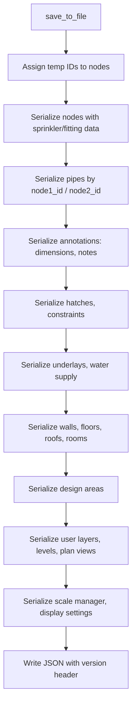
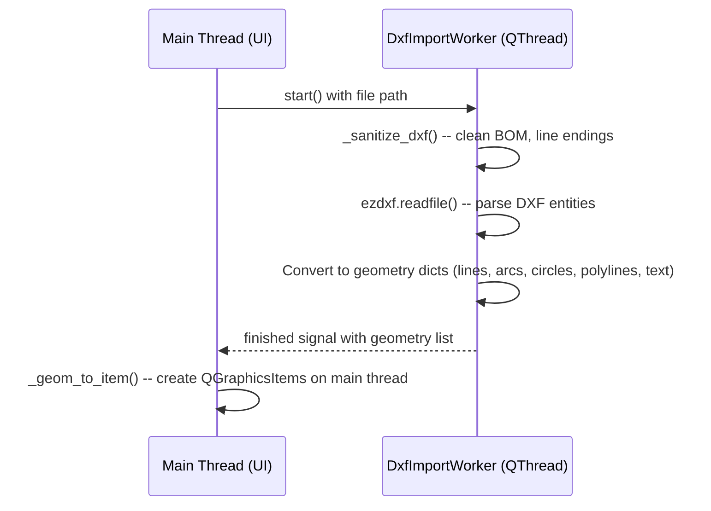

# I/O Subsystem

**Key files:**

- `firepro3d/scene_io.py` -- SceneIOMixin: JSON save/load (639 lines)
- `firepro3d/dxf_import_worker.py` -- DXF import via ezdxf (background thread)
- `firepro3d/pdf_import_worker.py` -- PDF import via PyMuPDF/fitz (background thread)
- `firepro3d/underlay.py` -- Underlay data model for imported images/PDFs

## Project file format

FirePro3D uses a versioned JSON format for project files (`.fp3d`). The current version is **9** (all dimensions stored in mm).

### Save process

`SceneIOMixin.save_to_file(filename)` serializes the entire scene:



Key details:
- Nodes are assigned temporary integer IDs for the save session
- Pipes reference nodes by these temp IDs (`node1_id`, `node2_id`)
- Per-instance display overrides (`_display_overrides`) are saved on each entity
- Scale calibration points and real distance are preserved
- Level definitions with elevations and display modes are serialized
- Display Manager category overrides are saved per-project

### Entity serialization

Each entity type follows a pattern:

```python
# Node serialization example
entry = {
    "id":             node_id[node],
    "x":              node.scenePos().x(),
    "y":              node.scenePos().y(),
    "elevation":      node.z_pos,
    "z_offset":       node.z_offset,
    "user_layer":     node.user_layer,
    "level":          node.level,
    "ceiling_level":  node.ceiling_level,
    "ceiling_offset_mm": node.ceiling_offset,
    "room_name":      node._room_name,
    "sprinkler":      node.sprinkler.get_properties() if node.has_sprinkler() else None,
}
# Optional: display_overrides, sprinkler_display_overrides, fitting_display_overrides
```

Pipes store their `_properties` dict values directly. Annotations store endpoint positions and property values.

### Load process

`SceneIOMixin.load_from_file(filename)` reverses the process:

1. Clear the scene (`_clear_scene()`)
2. Read JSON and check version
3. Recreate nodes at saved positions, restoring sprinklers and fittings
4. Recreate pipes by resolving node ID references
5. Restore annotations, construction geometry, walls, floors, roofs, rooms
6. Restore manager state (levels, plan views, user layers, scale calibration)
7. Apply display settings
8. Push initial undo state

### Version migration

The `SAVE_VERSION` (currently 9) enables forward migration. Older files may store dimensions in feet/inches rather than mm. The load path handles legacy keys (e.g., `elevation` in feet vs. `elevation_mm`) and unit conversions transparently.

## DXF import

`DxfImportWorker` runs DXF parsing on a background `QThread` using the `ezdxf` library.

### Design pattern



Key points:
- **No Qt GUI objects** are created on the worker thread -- only plain Python dicts
- QGraphicsItems are built on the main thread after the signal is received
- A `_sanitize_dxf()` pre-pass handles common DXF file issues: BOM markers, `\r\r\n` line endings, trailing whitespace after group codes
- The sanitized file is written to a temp file for ezdxf to parse

### Supported DXF entities

Lines, polylines (including lwpolyline), circles, arcs, text, mtext, hatches, and block inserts are converted to geometry descriptors.

## PDF import

`PdfImportWorker` extracts vector geometry from PDF files using PyMuPDF (fitz).

### Design pattern

Same background-thread pattern as DXF import. The worker:

1. Opens the PDF with `fitz.open()`
2. Extracts drawing commands (paths) from each page
3. Flattens cubic Bezier curves via De Casteljau subdivision (`_flatten_bezier()`)
4. Converts paths to line segment geometry dicts
5. Generates page thumbnails for the multi-page selection dialog
6. Emits results on the finished signal

The geometry dict output is compatible with the DXF import pipeline, so the same `_geom_to_item()` function processes both.

### Bezier flattening

PDF vector paths contain cubic Bezier curves. The `_flatten_bezier()` function recursively subdivides curves at `t = 0.5` until the chord deviation is below a tolerance (default 1.0 PDF points). This produces a polyline approximation suitable for QGraphicsItems.

## Background worker pattern

Both import workers follow the same pattern:

1. **Worker class** extends `QThread`
2. Worker operates on plain data -- no Qt widgets or scene items
3. Worker emits a `pyqtSignal` with results (list of geometry dicts)
4. Main thread slot receives results and creates QGraphicsItems
5. A `QProgressDialog` shows import progress on the main thread

This keeps the UI responsive during heavy file parsing. The strict separation between data parsing (worker thread) and item creation (main thread) avoids Qt's thread-safety constraints on QGraphicsItem.

## Connection to other subsystems

- **Model_Space** -- `SceneIOMixin` is mixed into Model_Space; save/load methods have direct access to all scene state
- **Entities** -- each entity's `get_properties()` / `set_property()` API is used for serialization
- **Level Manager** -- level definitions and plan views are serialized/deserialized
- **Scale Manager** -- calibration state is saved and restored
- **Display Manager** -- per-project category overrides and per-instance overrides are preserved
- **Undo system** -- load triggers a fresh undo state push; save clears the dirty flag
