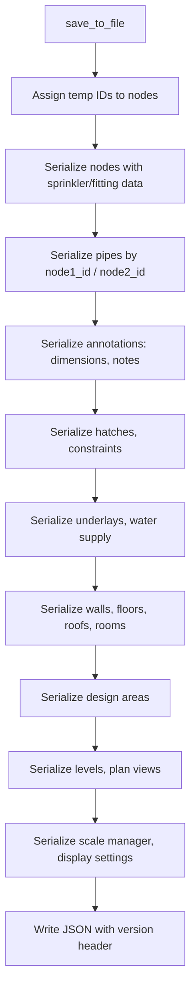
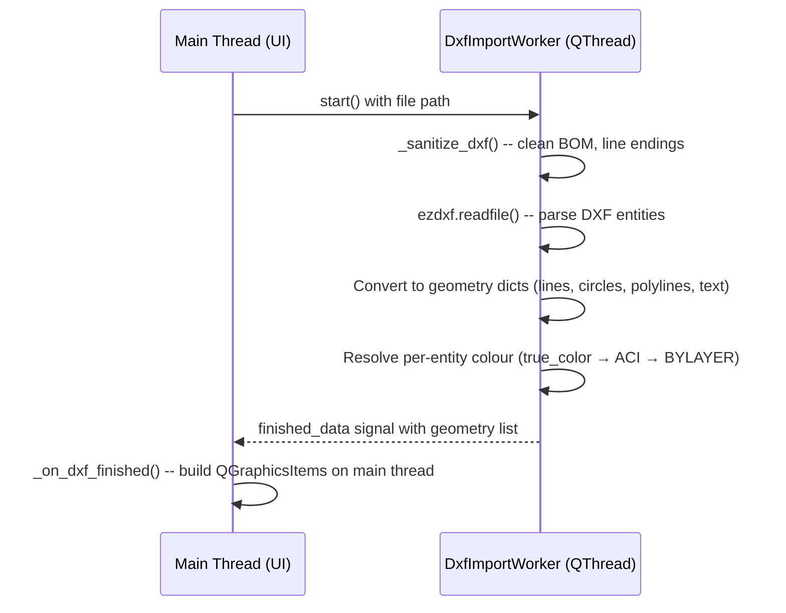

# I/O Subsystem

**Key files:**

- `firepro3d/scene_io.py` -- SceneIOMixin: JSON save/load (639 lines)
- `firepro3d/dxf_import_worker.py` -- DXF import via ezdxf (background thread)
- `firepro3d/pdf_import_worker.py` -- PDF import via PyMuPDF/fitz (background thread)
- `firepro3d/underlay.py` -- Underlay data model for imported images/PDFs

## Project file format

FirePro3D uses a versioned JSON format for project files (`.fpd`). The current version is **9** (`SAVE_VERSION = 9`; all dimensions stored in mm).

> The underlay/import pipeline (DXF/DWG/PDF data model, path resolution,
> caching) has a dedicated subsystem spec — see
> [`underlay-workflow.md`](../specs/underlay-workflow.md) for depth.

### Save process

`SceneIOMixin.save_to_file(filename)` serializes the entire scene:


```mermaid
flowchart TD
    A[save_to_file] --> B[Assign temp IDs to nodes]
    B --> C[Serialize nodes with sprinkler/fitting data]
    C --> D[Serialize pipes by node1_id / node2_id]
    D --> E[Serialize annotations: dimensions, notes]
    E --> F[Serialize hatches, constraints]
    F --> G[Serialize underlays, water supply]
    G --> H[Serialize walls, floors, roofs, rooms]
    H --> I[Serialize design areas]
    I --> J[Serialize levels, plan views]
    J --> K[Serialize scale manager, display settings]
    K --> L[Write JSON with version header]
```

Key details:
- Nodes are assigned temporary integer IDs for the save session
- Pipes reference nodes by these temp IDs (`node1_id`, `node2_id`)
- Per-instance display overrides (`_display_overrides`) are saved on each entity
- Scale calibration points and real distance are preserved
- Level definitions with elevations and view ranges are serialized
- Display Manager category overrides are saved per-project

### Entity serialization

Each entity type follows a pattern:

```python
# Node serialization example
entry = {
    "id":             node_id[node],
    "x":              node.scenePos().x(),
    "y":              node.scenePos().y(),
    "elevation":      node.z_pos,
    "level":          node.level,
    "ceiling_level":  node.ceiling_level,
    "ceiling_offset_mm": node.ceiling_offset,
    "room_name":      node._room_name,
    "sprinkler":      node.sprinkler.get_properties() if node.has_sprinkler() else None,
}
# Optional: display_overrides, sprinkler_display_overrides, fitting_display_overrides
```

Pipes store their `_properties` dict values directly. Annotations store endpoint positions and property values.

### Load process

`SceneIOMixin.load_from_file(filename)` reverses the process:

1. Clear the scene (`_clear_scene()`)
2. Read JSON and check version
3. Recreate nodes at saved positions, restoring sprinklers and fittings
4. Recreate pipes by resolving node ID references
5. Restore annotations, construction geometry, walls, floors, roofs, rooms
6. Restore manager state (levels, plan views, scale calibration)
7. Apply display settings
8. Push initial undo state

### Backward compatibility

The `version` field is **recorded** in every saved file (`SAVE_VERSION = 9`)
but the load path does **not** branch on it — there is no version-gated
migration code. Instead, backward compatibility is handled per-field by
**key presence**:

- Old files that stored a node's ceiling offset in inches under `ceiling_offset`
  are converted to mm on load (`ceiling_offset * 25.4`); new files write
  `ceiling_offset_mm` directly and it is used as-is.
- Removed keys from older formats (e.g. `user_layer`, `user_layers`, `z_offset`,
  `display_mode`) are simply not read — they fall through dict parsing and are
  silently ignored. No error, no migration step.

(The `SAVE_VERSION` number is reserved for forward-compat decisions; it is not
currently consumed by any conditional logic.)

## DXF import

`DxfImportWorker` runs DXF parsing on a background `QThread` using the `ezdxf` library.

### Design pattern


```mermaid
sequenceDiagram
    participant UI as Main Thread (UI)
    participant W as DxfImportWorker (QThread)

    UI->>W: start() with file path
    W->>W: _sanitize_dxf() -- clean BOM, line endings
    W->>W: ezdxf.readfile() -- parse DXF entities
    W->>W: Convert to geometry dicts (lines, circles, polylines, text)
    W->>W: Resolve per-entity colour (true_color → ACI → BYLAYER)
    W-->>UI: finished_data signal with geometry list
    UI->>UI: _on_dxf_finished() -- build QGraphicsItems on main thread
```

Key points:
- **No Qt GUI objects** are created on the worker thread -- only plain Python dicts
- QGraphicsItems are built on the main thread after the signal is received
- A `_sanitize_dxf()` pre-pass handles common DXF file issues: BOM markers, `\r\r\n` line endings, trailing whitespace after group codes
- The sanitized file is written to a temp file for ezdxf to parse
- **Per-entity colour** is resolved from DXF attributes: `true_color` (24-bit RGB) takes priority, then ACI index (1-255), then BYLAYER lookup from the layer table. The hex colour is stored in each geometry dict.
- **OCS normalisation** via `ezdxf.upright.upright()` is applied to each simple entity before coordinate extraction, fixing mirrored INSERT blocks with extrusion `(0,0,-1)`. Composite entities (INSERT/DIMENSION/HATCH) are skipped to avoid corrupting their transform for `virtual_entities()`.

### Supported DXF entities

Lines, polylines (LWPOLYLINE via `get_points()`, POLYLINE via `.vertices`), circles, ellipses, splines, text, mtext, hatches, and block inserts are converted to geometry descriptors. ARC entities are converted to polyline points via trigonometry to avoid angle-convention mismatches between `QGraphicsEllipseItem` and `QPainterPath.arcTo`. TEXT/MTEXT entities include the DXF text height (`dxf.height` / `dxf.char_height`) as a `"size"` field, alignment (`halign`/`valign` from alignment mode or MTEXT attachment_point), and plain text with newlines preserved; empty text strings are filtered out.

INSERT block explosion uses per-entity exception handling: the `virtual_entities()` generator is materialized to a list first, then each sub-entity is extracted in its own `try/except`. This prevents one unsupported entity type from silently dropping all subsequent entities in the block. ATTRIB text on INSERT blocks is extracted separately after the virtual entities loop.

### Preview rendering

The DXF preview dialog (`dxf_preview_dialog.py`) batches all geometry into a small number of `QPainterPath` objects (one per pen style) rather than creating individual `QGraphicsItem` instances. This reduces 293K+ items to ~6, enabling interactive preview of large files. Text is rendered as `QPainterPath.addText()` with multiline support (splits on `\n`, renders each line at vertical offset) and alignment offsets computed via `QFontMetricsF` (halign: left/center/right; valign: top/middle/bottom/baseline).

### Underlay cache

Geometry dicts are cached as JSON in `<project>.fpd.cache/` (see `underlay_cache.py`). The cache version (`_CACHE_VERSION = 4`) is checked on load; stale caches are automatically re-extracted synchronously during project load. For DWG files, this triggers ODA re-conversion.

## DWG import

DWG files are converted to DXF via ODA File Converter (external CLI tool) and then follow the unified DXF import path. `_load_dwg()` is a thin wrapper: convert → `read_dxf()` → `_load_dxf(_doc=doc)`.

### Module

`dwg_converter.py` handles ODA discovery, conversion, layout listing (`list_layouts()`), viewport bounds extraction, geometry filtering, and paper-layout entity transformation.

### Flow (unified DXF/DWG)

1. **DWG only: ODA conversion** — finds `ODAFileConverter.exe` via QSettings/PATH/common dirs, converts to DXF in `UNDERLAY_REF/` for reuse, skips if cached DXF is fresh
2. **DXF read** — `ezdxf.readfile()` (DWG path bypasses `_sanitize_dxf()` via `_doc` parameter), doc stored as `self._doc`
3. **Layout detection** — `list_layouts(doc)` enumerates layouts; combo shown in right panel if 2+ layouts, extraction deferred until selection
4. **`_extract_for_layout()`** — unified extraction pipeline:
   a. Viewport bounds from VIEWPORT entities (paper layouts only)
   b. Model-space extraction with entity pre-filter
   c. Post-extraction `filter_geoms_by_bounds()`
   d. Paper layout entity transform (position + text size scaled by `ps_to_ms`, alignment preserved)
   e. DWG first extraction: entity type dialog
5. **Preview rebuild** — layers populated, QPainterPath-batched preview rendered

### Performance

The DXF is read once and the `doc` object is shared across layout switches. Entity type dialog (DWG only) shows post-filter geometry counts so the user can deselect heavy types before preview rebuild.

## PDF import

`PdfImportWorker` extracts vector geometry from PDF files using PyMuPDF (fitz).

### Design pattern

Same background-thread pattern as DXF import. The worker:

1. Opens the PDF with `fitz.open()`
2. Extracts drawing commands (paths) from each page
3. Flattens cubic Bezier curves via De Casteljau subdivision (`_flatten_bezier()`)
4. Converts paths to line segment geometry dicts
5. Generates page thumbnails for the multi-page selection dialog
6. Emits results on the finished signal

The geometry dict output is compatible with the DXF import pipeline, so both share the same main-thread item-building helpers (`_append_geom_to_path` / `_build_pen_cache`); PDF vector underlays are assembled via `_import_pdf_vectors()`.

### Bezier flattening

PDF vector paths contain cubic Bezier curves. The `_flatten_bezier()` function recursively subdivides curves at `t = 0.5` until the chord deviation is below a tolerance (default 1.0 PDF points). This produces a polyline approximation suitable for QGraphicsItems.

## Background worker pattern

Both import workers follow the same pattern:

1. **Worker class** extends `QThread`
2. Worker operates on plain data -- no Qt widgets or scene items
3. Worker emits a `pyqtSignal` with results (list of geometry dicts)
4. Main thread slot receives results and creates QGraphicsItems
5. A `QProgressDialog` shows import progress on the main thread

This keeps the UI responsive during heavy file parsing. The strict separation between data parsing (worker thread) and item creation (main thread) avoids Qt's thread-safety constraints on QGraphicsItem.

## Connection to other subsystems

- **Model_Space** -- `SceneIOMixin` is mixed into Model_Space; save/load methods have direct access to all scene state
- **Entities** -- each entity's `get_properties()` / `set_property()` API is used for serialization
- **Level Manager** -- level definitions and plan views are serialized/deserialized
- **Scale Manager** -- calibration state is saved and restored
- **Display Manager** -- per-project category overrides and per-instance overrides are preserved
- **Undo system** -- load triggers a fresh undo state push; save clears the dirty flag
- **Paper space** -- paper mutations dirty the project and crash recovery restores sheets with full open parity; contract owned by `docs/specs/paper-space.md` §17.7
