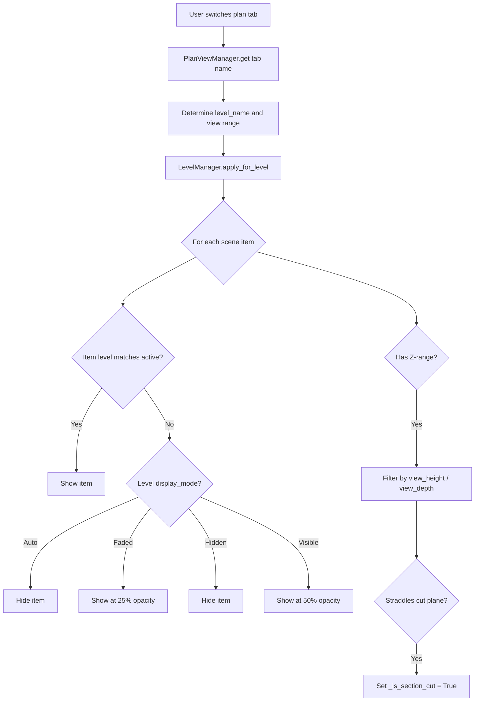

# Level System

**Key files:**

- `firepro3d/level_manager.py` -- Level definitions, elevation values, visibility filtering
- `firepro3d/elevation_manager.py` -- Elevation view tab management (N/S/E/W)
- `firepro3d/scale_manager.py` -- Unit conversion and calibration
- `firepro3d/constants.py` -- Default level name, ceiling offset

## Overview

The level system provides multi-story building support. Each entity in the scene is assigned to a floor level. Switching between plan view tabs changes which level's entities are visible, with configurable display modes for entities on other levels.

## LevelManager

`LevelManager` is a pure-data manager (no Qt widgets) that maintains an ordered list of `Level` dataclass objects:

```python
@dataclass
class Level:
    name:         str              # e.g. "Level 1", "Level 2"
    elevation:    float = 0.0      # mm, relative to project datum
    view_top:     float = 2000.0   # mm above elevation (default cut-plane offset)
    view_bottom:  float = -1000.0  # mm below elevation (default view depth)
    display_mode: str   = "Auto"   # Auto | Hidden | Faded | Visible
```

Default levels shipped with every new document:

| Name | Elevation (mm) | Elevation (ft) |
|------|---------------|----------------|
| Level 1 | 0.0 | 0'-0" |
| Level 2 | 3,048.0 | 10'-0" |
| Level 3 | 6,096.0 | 20'-0" |

### Key operations

- **add_level(name, elevation)** -- creates a new level; auto-generates name if not provided
- **remove_level(name)** -- deletes a level (at least one must remain)
- **rename_level(old, new, items)** -- renames a level and updates all scene items that referenced it
- **update_elevations(scene)** -- recomputes `z_pos` for all nodes using `ceiling_level` elevation + `ceiling_offset`
- **to_list() / from_list(data)** -- serialization for project save/load
- **reset()** -- restores default levels (used on new file)

## How entities are assigned to levels

Every entity with `DisplayableItemMixin` has a `level` attribute (string). This is set:

- At creation time, from `Model_Space.active_level`
- On load, from the saved project data
- Manually via the property panel's Level field

For piping entities, there is an additional `ceiling_level` attribute. A node's 3D elevation is computed as:

```
z_pos = level_elevation(ceiling_level) + ceiling_offset
```

The default `ceiling_offset` is -50.8 mm (-2 inches), representing the sprinkler deflector position below the ceiling.

## Plan views and visibility



`PlanViewManager` stores per-view cut-plane settings:

```python
@dataclass
class PlanView:
    name:        str           # "Plan: Level 1"
    level_name:  str           # "Level 1"
    view_height: float         # mm, absolute cut-plane elevation
    view_depth:  float         # mm, absolute bottom limit
```

Smart defaults for new plan views:
- **view_depth** = level elevation + level's `view_bottom` offset
- **view_height** = next level's elevation minus slab thickness (152.4 mm / 6"), or level elevation + `view_top` if no level above

## Elevation views

`ElevationManager` manages side-view tabs for four compass directions (North, South, East, West). Each direction gets at most one tab. The manager:

1. Creates an `ElevationScene` that reads entity data from `Model_Space`
2. Wraps it in an `ElevationView` widget
3. Adds the tab to the central `QTabWidget`
4. Reuses existing tabs if the direction is already open

Elevation scenes project 3D entity positions onto a 2D side view, showing level datum lines and entity profiles.

## ScaleManager

`ScaleManager` handles the mapping between scene coordinates and real-world units.

### Internal unit

All geometry is stored in **millimeters**. One scene unit = one millimeter.

### Display units

Three display modes via `DisplayUnit` enum:

| Enum | Format | Example |
|------|--------|---------|
| `IMPERIAL` | feet-inches | 10'-6" |
| `METRIC_MM` | millimeters | 3200.0 mm |
| `METRIC_M` | meters | 3.200 m |

### Calibration workflow

When working with imported underlays (PDF/DXF), the user calibrates the scene:

1. User activates "Set Scale" mode
2. Picks two points on the underlay
3. Enters the real-world distance between them and the unit
4. ScaleManager computes `pixels_per_mm = scene_distance / real_mm`

After calibration, all length measurements and display strings use the correct scale.

### Key methods

- `calibrate(pt1, pt2, distance, unit)` -- set scale from two points
- `format_length(mm)` -- format a millimeter value for display (respects display unit)
- `scene_to_mm(scene_dist)` -- convert scene pixels to millimeters
- `parse_dimension(text, unit)` -- parse user-entered dimension text to mm
- `paper_to_scene(paper_mm)` -- convert paper millimeters to scene units using drawing scale
- `drawing_scale` property -- denominator of the drawing scale (e.g., 100 for 1:100)

### Drawing scale

The `drawing_scale` (default 100.0) affects how "paper-space" dimensions map to scene coordinates. This is used for:

- Wall thickness display (thickness in mm / drawing_scale = paper mm)
- Fitting symbol sizing
- Annotation text sizing

## Connection to other subsystems

- **Model_Space** -- owns both managers; `active_level` tracks which level is being edited
- **Entities** -- carry `level`, `ceiling_level`, `ceiling_offset` attributes
- **Display Manager** -- section-cut hatching depends on `_is_section_cut` flag set by level filtering
- **Scene I/O** -- serializes level list, plan views, and scale calibration data
- **3D View** -- uses level elevations to place entities vertically
- **Hydraulic Solver** -- uses ScaleManager to convert scene-pixel pipe lengths to feet for pressure calculations
