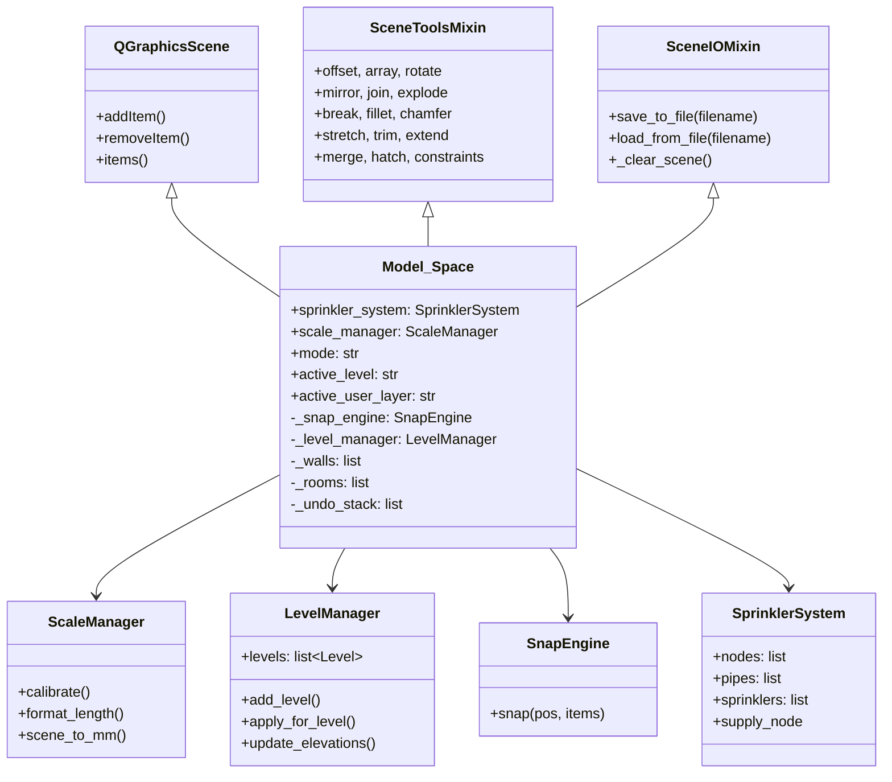

# Architecture Overview

**Key files:**

- `firepro3d/model_space.py` -- Central scene class (7,195 lines, 196 methods)
- `firepro3d/scene_tools.py` -- Geometry editing tools mixin (1,612 lines)
- `firepro3d/scene_io.py` -- Save/load mixin (639 lines)
- `firepro3d/model_view.py` -- 2D QGraphicsView with snapping and zoom
- `firepro3d/main.py` -- Entry point, QMainWindow with ribbon UI
- `firepro3d/constants.py` -- Shared constants (Z-ordering, NFPA limits)

## Model_Space: the central hub

`Model_Space` is the core of the application. It inherits from three classes using Python's mixin pattern:

```python
class Model_Space(SceneToolsMixin, SceneIOMixin, QGraphicsScene):
```

- **QGraphicsScene** (PyQt6) -- provides the 2D canvas, item management, hit testing
- **SceneToolsMixin** (`scene_tools.py`) -- offset, array, rotate, scale, mirror, join, explode, break, fillet, chamfer, stretch, trim, extend, merge, hatch, constraints
- **SceneIOMixin** (`scene_io.py`) -- JSON save/load, scene clearing, serialization of all entity types

Model_Space owns all scene data and coordinates interaction between the view, managers, and entities.

## Manager services

Model_Space delegates specialized concerns to manager objects:

| Manager | File | Responsibility |
|---------|------|---------------|
| `ScaleManager` | `scale_manager.py` | Calibration, unit conversion (mm internal to display units) |
| `LevelManager` | `level_manager.py` | Floor levels, elevations, level visibility |
| `SnapEngine` | `snap_engine.py` | OSNAP system (endpoint, midpoint, intersection, perpendicular) |
| `DisplayManager` | `display_manager.py` | Per-category and per-instance visibility, colour, opacity |
| `SprinklerSystem` | `sprinkler_system.py` | Network model (nodes, pipes, sprinklers collections) |
| `PlanViewManager` | `level_manager.py` | Per-view cut-plane settings for plan tabs |
| `ElevationManager` | `elevation_manager.py` | Elevation view tabs (N/S/E/W compass directions) |

Some managers (LevelManager, PlanViewManager, ElevationManager) are injected by `main.py` after construction. Others (ScaleManager, SnapEngine, SprinklerSystem) are created in `Model_Space.__init__`.

## Signal-based communication

Model_Space communicates with the UI through PyQt6 signals, keeping the scene decoupled from specific UI widgets:

```python
requestPropertyUpdate = pyqtSignal(object)       # property panel refresh
cursorMoved = pyqtSignal(str)                     # status bar coordinate display
underlaysChanged = pyqtSignal()                   # layer manager refresh
modeChanged = pyqtSignal(str)                     # status bar mode indicator
instructionChanged = pyqtSignal(str)              # step-by-step tool instructions
sceneModified = pyqtSignal()                      # dirty flag / undo state
radiationConfirm = pyqtSignal()                   # Enter during radiation selection
radiationCancel = pyqtSignal()                    # Escape during radiation selection
openViewRequested = pyqtSignal(str, str)          # view marker double-click
numericInputRequested = pyqtSignal(...)           # prompt user for a dimension
warningIssued = pyqtSignal(str, str)              # show warning dialog
confirmRequested = pyqtSignal(str, str, str)      # show confirmation dialog
```

Dialog-triggering signals (`numericInputRequested`, `warningIssued`, `confirmRequested`) allow the scene to request UI without importing dialog classes directly.

## Data flow

```
User input (mouse/keyboard)
        |
        v
   Model_View (QGraphicsView)
     - zoom, pan, snap coordination
     - routes events to Model_Space
        |
        v
   Model_Space (QGraphicsScene)
     - mode state machine (select, add_pipe, draw_wall, etc.)
     - creates/modifies entities
     - pushes undo states
        |
        +----> ScaleManager (unit conversion)
        +----> SnapEngine (OSNAP hit testing)
        +----> LevelManager (floor visibility)
        +----> SprinklerSystem (network model)
        +----> DisplayManager (appearance overrides)
        |
        v
   Entities (Node, Pipe, Sprinkler, Wall, Room, ...)
     - QGraphicsItem subclasses on the scene
     - each carries level, user_layer, display overrides
```

## Composition diagram



## Mode state machine

Model_Space uses a `self.mode` string to track the current interactive tool. Mouse and keyboard events are dispatched based on this mode. Examples:

- `None` / `"select"` -- default selection and property editing
- `"add_pipe"` -- two-click pipe placement
- `"draw_wall"` -- chain-click wall drawing
- `"draw_room"` -- manual room boundary drawing
- `"offset"`, `"rotate"`, `"scale"`, `"mirror"` -- transform tools
- `"trim"`, `"extend"`, `"break"` -- editing tools
- `"set_scale"` -- two-point calibration

The `modeChanged` signal notifies the status bar, and `instructionChanged` provides step-by-step guidance text.

## Undo/redo

Model_Space maintains an undo stack (`_undo_stack`, max 50 entries) of full scene snapshots serialized as JSON dictionaries. Each `push_undo_state()` call captures the complete scene state. Undo/redo restores by clearing and re-loading from a snapshot. The `sceneModified` signal fires on each push to track dirty state.

## Connection to other subsystems

- **Display system** (`display_manager.py`) -- applies category-level defaults on load; per-instance overrides stored on each entity
- **Level system** (`level_manager.py`) -- filters entity visibility when switching plan tabs
- **Analysis** (`hydraulic_solver.py`, `thermal_radiation_solver.py`) -- reads the piping network from SprinklerSystem
- **I/O** (`scene_io.py`) -- serializes all entities, managers, and settings to versioned JSON (currently version 9)
- **3D view** (`view_3d.py`) -- reads entity data from Model_Space to build 3D meshes
