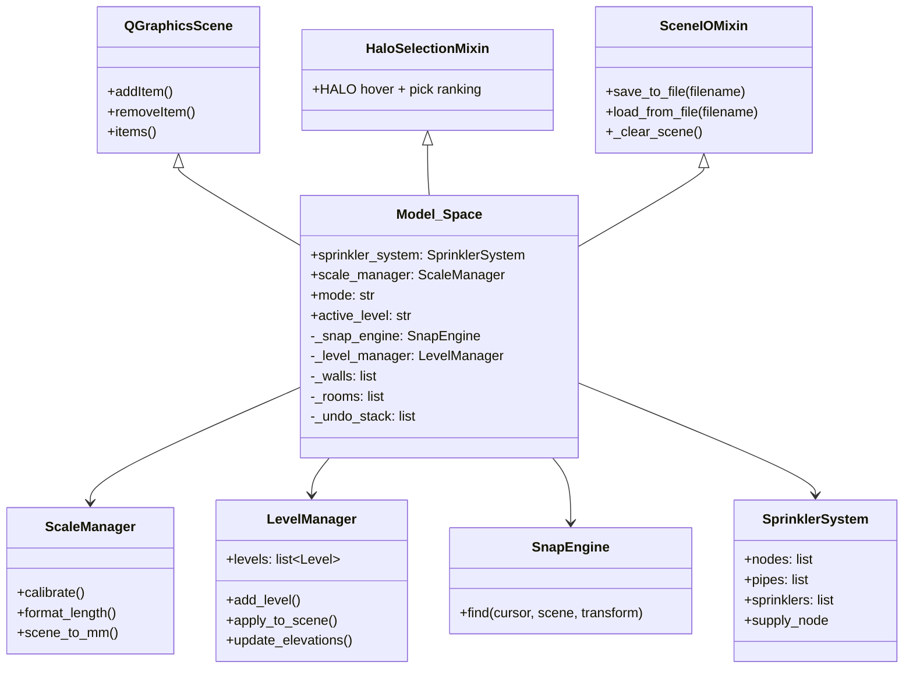

# Architecture Overview

**Key files:**

- `firepro3d/model_space.py` -- Central scene class (`Model_Space`)
- `firepro3d/scene_tools.py` -- Geometry editing tools (composed collaborator `SceneTools`)
- `firepro3d/scene_io.py` -- Save/load mixin
- `firepro3d/model_view.py` -- 2D QGraphicsView with snapping and zoom
- `main.py` (project root) -- Entry point, QMainWindow with ribbon UI
- `firepro3d/constants.py` -- Shared constants (Z-ordering, NFPA limits)

## Model_Space: the central hub

`Model_Space` is the core of the application: a `QGraphicsScene` plus two
state-sharing mixins (`HaloSelectionMixin`, `SceneIOMixin`) and a growing set of
**composed domain controllers** (geometry tools, pipe network, sprinkler
workflow, placement input, 2D-geometry drawing, wall/feature placement, modify
tools, text editing, underlays). The exact composition, the decomposition
contract and the slice history are owned by
[`model-space-architecture.md`](../specs/model-space-architecture.md) — this
page does not restate them.

Model_Space owns all scene data and coordinates interaction between the view, managers, and entities.

## Manager services

Model_Space delegates specialized concerns to manager objects:

| Manager | File | Responsibility |
|---------|------|---------------|
| `ScaleManager` | `scale_manager.py` | Calibration, unit conversion (mm internal to display units) |
| `LevelManager` | `level_manager.py` | Floor levels, elevations, level visibility |
| `SnapEngine` | `snap_engine.py` | OSNAP system (endpoint, midpoint, intersection, perpendicular) |
| `DisplayManager` | `display_manager.py` | Per-category and per-instance visibility, colour, opacity |
| `SprinklerSystem` | `sprinkler_system.py` | Network model (nodes, pipes, sprinklers collections) |
| `PlanViewManager` | `level_manager.py` | Per-view cut-plane settings for plan tabs |
| `ElevationManager` | `elevation_manager.py` | Elevation view tabs (N/S/E/W compass directions) |

Some managers (LevelManager, PlanViewManager, ElevationManager) are injected by `main.py` after construction. Others (ScaleManager, SnapEngine, SprinklerSystem) are created in `Model_Space.__init__`.

**Visibility interaction:** `LevelManager._set_level_vis()` checks `_display_overrides["visible"]` before applying level filtering. Items with `visible == False` are skipped entirely (no Z-ordering, opacity, or selectability changes). This ensures user-hidden items persist across level switches.

## Signal-based communication

Model_Space communicates with the UI through PyQt6 signals, keeping the scene decoupled from specific UI widgets:

```python
requestPropertyUpdate = pyqtSignal(object)       # property panel refresh
cursorMoved = pyqtSignal(str)                     # status bar coordinate display
underlaysChanged = pyqtSignal()                   # underlay list changed (browser / Underlay Manager refresh)
modeChanged = pyqtSignal(str)                     # status bar mode indicator
instructionChanged = pyqtSignal(str)              # step-by-step tool instructions
sceneModified = pyqtSignal()                      # dirty flag / undo state
radiationConfirm = pyqtSignal()                   # Enter during radiation selection
radiationCancel = pyqtSignal()                    # Escape during radiation selection
openViewRequested = pyqtSignal(str, str)          # view marker double-click
warningIssued = pyqtSignal(str, str)              # show warning dialog
confirmRequested = pyqtSignal(str, str, str)      # show confirmation dialog
```

Dialog-triggering signals (`warningIssued`, `confirmRequested`) allow the scene to request UI without importing dialog classes directly.

## Data flow

```
User input (mouse/keyboard)
        |
        v
   Model_View (QGraphicsView)
     - zoom, pan, snap coordination
     - routes events to Model_Space
        |
        v
   Model_Space (QGraphicsScene)
     - mode state machine (select, add_pipe, draw_wall, etc.)
     - creates/modifies entities
     - pushes undo states
        |
        +----> ScaleManager (unit conversion)
        +----> SnapEngine (OSNAP hit testing)
        +----> LevelManager (floor visibility)
        +----> SprinklerSystem (network model)
        +----> DisplayManager (appearance overrides)
        |
        v
   Entities (Node, Pipe, Sprinkler, Wall, Room, ...)
     - QGraphicsItem subclasses on the scene
     - each carries level and display overrides
```

## Composition diagram


```mermaid
classDiagram
    class QGraphicsScene {
        +addItem()
        +removeItem()
        +items()
    }

    class HaloSelectionMixin {
        +HALO hover + pick ranking
    }

    class SceneIOMixin {
        +save_to_file(filename)
        +load_from_file(filename)
        +_clear_scene()
    }

    class Model_Space {
        +sprinkler_system: SprinklerSystem
        +scale_manager: ScaleManager
        +mode: str
        +active_level: str
        -_snap_engine: SnapEngine
        -_level_manager: LevelManager
        -_walls: list
        -_rooms: list
        -_undo_stack: list
    }

    class ScaleManager {
        +calibrate()
        +format_length()
        +scene_to_mm()
    }

    class LevelManager {
        +levels: list~Level~
        +add_level()
        +apply_to_scene()
        +update_elevations()
    }

    class SnapEngine {
        +find(cursor, scene, transform)
    }

    class SprinklerSystem {
        +nodes: list
        +pipes: list
        +sprinklers: list
        +supply_node
    }

    QGraphicsScene <|-- Model_Space
    HaloSelectionMixin <|-- Model_Space
    SceneIOMixin <|-- Model_Space

    Model_Space --> ScaleManager
    Model_Space --> LevelManager
    Model_Space --> SnapEngine
    Model_Space --> SprinklerSystem
```

## Mode state machine

Model_Space uses a `self.mode` string to track the current interactive tool. Mouse and keyboard events are dispatched based on this mode. Examples:

- `None` / `"select"` -- default selection and property editing
- `"pipe"` -- two-click pipe placement
- `"wall"` -- chain-click wall drawing
- `"room_manual"` -- manual room boundary drawing
- 2D modify tools (move, rotate, scale, flip / mirror, offset, array, copy / paste …) -- modes, entry points and behaviour owned by [`scene-tools.md`](../specs/scene-tools.md)
- `"set_scale"` -- two-point calibration

The `modeChanged` signal notifies the status bar, and `instructionChanged` provides step-by-step guidance text.

## Undo/redo

Model_Space maintains an undo stack (`_undo_stack`, `UNDO_MAX` entries) of scene snapshots serialized as dictionaries by `_capture_network()` — the model content, **excluding** underlays and scale — and restored by `_restore_network()`. This snapshot path is the second of the two serialization paths whose parity is an invariant owned by [`scene-io.md`](../specs/scene-io.md). Paper space keeps its own `QUndoStack` (`paper_commands.py`). The `sceneModified` signal fires on each push to track dirty state.

## Connection to other subsystems

- **Display system** (`display_manager.py`) -- applies category-level defaults on load; per-instance overrides stored on each entity
- **Level system** (`level_manager.py`) -- filters entity visibility when switching plan tabs
- **Analysis** (`hydraulic_solver.py`, `thermal_radiation_solver.py`) -- reads the piping network from SprinklerSystem
- **I/O** (`scene_io.py`) -- serializes all entities, managers, and settings to versioned JSON (currently version 9)
- **3D view** (`view_3d.py`) -- reads entity data from Model_Space to build 3D meshes; closable keep-alive canvas tab → [`view-3d.md`](../specs/view-3d.md)
- **Sprinkler design** (`design_area.py`, `water_supply.py`) -- design areas and the water-supply node feed the hydraulic solver → [`sprinkler-system-components.md`](../specs/sprinkler-system-components.md)
- **Gridlines** (`gridline.py`) -- `GridlineItem` + bubbles, snap and ALIGN participation → [`grid-system.md`](../specs/grid-system.md)
- **Detail views** (`detail_view.py`) -- `DetailMarker` / `DetailViewManager`, a clipped second view on the same scene → [`view-relationships.md`](../specs/view-relationships.md)
- **Blocks** (`block_definition.py`, `block_instance.py`, `block_library.py`) -- flyweight definition/instance + library → [`block-system.md`](../specs/block-system.md)
- **Parametric constraints** (`constraints.py`) -- concentric / dimensional / alignment constraints → [`parametric-constraint-system.md`](../specs/parametric-constraint-system.md)
- **Theme** (`theme.py`) -- colour / metrics / typography tokens → [`theming.md`](theming.md)

The full file → governing-spec lookup is [`SPEC-INDEX.md`](../specs/SPEC-INDEX.md).
