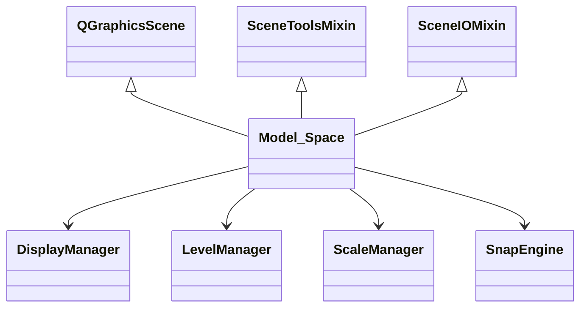

# FirePro3D Documentation & Packaging Implementation Plan

> **For agentic workers:** REQUIRED SUB-SKILL: Use superpowers:subagent-driven-development (recommended) or superpowers:executing-plans to implement this plan task-by-task. Steps use checkbox (`- [ ]`) syntax for tracking.

**Goal:** Restructure FirePro3D from flat files into a `firepro3d/` Python package, set up MkDocs with auto-generated API reference, and write hand-crafted architecture + contributing documentation.

**Architecture:** 73 Python files move into `firepro3d/` (flat package, single `__init__.py`). 4 files get PEP 8 renames. `main.py` stays at root. MkDocs with Material theme generates a static docs site from markdown in `docs/` plus auto-generated API reference via mkdocstrings/griffe (static analysis, no imports).

**Tech Stack:** Python 3.x, PyQt6, MkDocs Material, mkdocstrings[python], mkdocs-gen-files, mkdocs-literate-nav

**Spec:** `docs/superpowers/specs/2026-04-04-documentation-design.md`

---

## File Map

### New files created

| File | Purpose |
|------|---------|
| `firepro3d/__init__.py` | Package marker (minimal) |
| `firepro3d/assets.py` | `ASSETS_DIR` constant + `asset_path()` helper for graphics resolution |
| `mkdocs.yml` | MkDocs configuration |
| `docs/requirements.txt` | Doc build dependencies |
| `docs/gen_ref_pages.py` | Build-time script generating API reference pages |
| `docs/index.md` | Project overview |
| `docs/getting-started.md` | Setup and install guide |
| `docs/architecture/overview.md` | System architecture narrative |
| `docs/architecture/entities.md` | Entity hierarchy and relationships |
| `docs/architecture/display-system.md` | DisplayManager, Z-ordering |
| `docs/architecture/level-system.md` | Multi-floor, elevations, ScaleManager |
| `docs/architecture/analysis.md` | Hydraulic + thermal solvers |
| `docs/architecture/io.md` | Serialization, DXF/PDF import |
| `docs/architecture/refactoring.md` | Refactoring candidates |
| `docs/contributing/guide.md` | Code style and conventions |
| `docs/contributing/adding-entities.md` | Recipe: new entity type |
| `docs/contributing/adding-tools.md` | Recipe: new drawing tool |

### Files modified

| File | Change |
|------|--------|
| `.gitignore` | Replace 8K-line file with standard Python gitignore |
| `main.py` | Update 23 internal imports to `from firepro3d.*` |
| `CLAUDE.md` | Slim down, link to docs |
| All 73 `.py` files in `firepro3d/` | Update internal imports to relative (`from .node import Node`) |
| `firepro3d/fitting.py` | Update bare graphics paths to use `asset_path()` |
| `firepro3d/sprinkler.py` | Update bare graphics paths to use `asset_path()` |
| `firepro3d/display_manager.py` | Update bare graphics paths to use `asset_path()` |

### Files moved + renamed

| From | To |
|------|-----|
| `Model_Space.py` | `firepro3d/model_space.py` |
| `Model_View.py` | `firepro3d/model_view.py` |
| `CAD_Math.py` | `firepro3d/cad_math.py` |
| `Annotations.py` | `firepro3d/annotations.py` |
| All other 69 `.py` files | `firepro3d/<same_name>.py` |
| `graphics/` | `firepro3d/graphics/` |

---

## Task 1: Clean up .gitignore

**Files:**
- Modify: `.gitignore`

- [ ] **Step 1: Replace .gitignore with standard Python gitignore**

Write this content to `.gitignore`:

```gitignore
# Python
__pycache__/
*.py[cod]
*$py.class
*.so
*.egg-info/
*.egg
dist/
build/
eggs/
*.whl

# Virtual environment
venv/
.venv/
ENV/

# IDE
.vscode/
.idea/
*.swp
*.swo
*~

# MkDocs
site/

# OS
.DS_Store
Thumbs.db

# Project
*.pyc
.claude/
```

- [ ] **Step 2: Verify the app still runs**

Run:
```bash
cd "D:/Custom Code/FirePro3D" && python -c "import sys; print('Python OK:', sys.version)"
```
Expected: Python version prints without error.

- [ ] **Step 3: Commit**

```bash
git add .gitignore
git commit -m "chore: replace bloated .gitignore with standard Python gitignore"
```

---

## Task 2: Create firepro3d/ package and move files

**Files:**
- Create: `firepro3d/__init__.py`
- Move: all 73 `.py` files (except `main.py`) into `firepro3d/`
- Move: `graphics/` into `firepro3d/graphics/`
- Rename: `Model_Space.py` → `model_space.py`, `Model_View.py` → `model_view.py`, `CAD_Math.py` → `cad_math.py`, `Annotations.py` → `annotations.py`

- [ ] **Step 1: Create package directory and __init__.py**

```bash
mkdir -p "D:/Custom Code/FirePro3D/firepro3d"
```

Write `firepro3d/__init__.py`:

```python
"""FirePro3D — Fire protection sprinkler system design and analysis."""
```

- [ ] **Step 2: Move and rename Python files using git mv**

Run each `git mv` command. The 4 renamed files:

```bash
cd "D:/Custom Code/FirePro3D"
git mv Model_Space.py firepro3d/model_space.py
git mv Model_View.py firepro3d/model_view.py
git mv CAD_Math.py firepro3d/cad_math.py
git mv Annotations.py firepro3d/annotations.py
```

Then move all remaining `.py` files (except `main.py`):

```bash
cd "D:/Custom Code/FirePro3D"
for f in *.py; do
  if [ "$f" != "main.py" ]; then
    git mv "$f" "firepro3d/$f"
  fi
done
```

- [ ] **Step 3: Move graphics directory**

```bash
cd "D:/Custom Code/FirePro3D"
git mv graphics firepro3d/graphics
```

- [ ] **Step 4: Verify file structure**

```bash
ls "D:/Custom Code/FirePro3D/firepro3d/"*.py | head -20
ls "D:/Custom Code/FirePro3D/firepro3d/graphics/"
ls "D:/Custom Code/FirePro3D/main.py"
```

Expected: 73 `.py` files + `__init__.py` in `firepro3d/`, `graphics/` subdirectories present, `main.py` at root.

- [ ] **Step 5: Commit the move (before fixing imports)**

```bash
git add firepro3d/__init__.py
git commit -m "refactor: move all modules into firepro3d/ package with PEP 8 renames

Moves 73 .py files into firepro3d/ flat package.
Renames: Model_Space→model_space, Model_View→model_view, CAD_Math→cad_math, Annotations→annotations.
Moves graphics/ into firepro3d/graphics/.
Imports are broken at this point — fixed in next commit."
```

---

## Task 3: Create assets.py for graphics path resolution

**Files:**
- Create: `firepro3d/assets.py`

- [ ] **Step 1: Create assets.py**

Write `firepro3d/assets.py`:

```python
"""Centralized asset path resolution for graphics and other resources."""

import os

# Directory containing this file (firepro3d/)
_PACKAGE_DIR = os.path.dirname(os.path.abspath(__file__))

# Root of the graphics assets
ASSETS_DIR = os.path.join(_PACKAGE_DIR, "graphics")


def asset_path(*parts: str) -> str:
    """Build an absolute path under firepro3d/graphics/.

    Args:
        *parts: Path components relative to graphics/.
            e.g. asset_path("fitting_symbols", "tee.svg")

    Returns:
        Absolute path to the asset file.
    """
    return os.path.join(ASSETS_DIR, *parts)
```

- [ ] **Step 2: Commit**

```bash
git add firepro3d/assets.py
git commit -m "feat: add assets.py for centralized graphics path resolution"
```

---

## Task 4: Fix all internal imports within firepro3d/

This is the largest mechanical task. All internal imports within `firepro3d/` change to relative imports. The 4 renamed modules need their new names.

**Files:**
- Modify: all 73 `.py` files in `firepro3d/`

- [ ] **Step 1: Fix imports from renamed modules**

These are the search-and-replace patterns to apply across all files in `firepro3d/`:

| Old import | New import |
|------------|-----------|
| `from Model_Space import` | `from .model_space import` |
| `from Model_View import` | `from .model_view import` |
| `from CAD_Math import` | `from .cad_math import` |
| `from Annotations import` | `from .annotations import` |
| `import Model_Space` | `from . import model_space` (then fix references) |

Run these replacements across all `.py` files in `firepro3d/`:

```bash
cd "D:/Custom Code/FirePro3D"
# Replace renamed module imports
find firepro3d -name "*.py" -exec sed -i 's/from Model_Space import/from .model_space import/g' {} +
find firepro3d -name "*.py" -exec sed -i 's/from Model_View import/from .model_view import/g' {} +
find firepro3d -name "*.py" -exec sed -i 's/from CAD_Math import/from .cad_math import/g' {} +
find firepro3d -name "*.py" -exec sed -i 's/from Annotations import/from .annotations import/g' {} +
```

- [ ] **Step 2: Fix all other internal imports to relative**

Convert all remaining internal `from <module> import` to `from .<module> import`. The internal modules (not renamed) are:

```bash
cd "D:/Custom Code/FirePro3D"

# All internal module names that need from X → from .X conversion
# This list covers every internal module found in the codebase
MODULES=(
  "node" "pipe" "sprinkler" "room" "wall" "fitting" "roof" "floor_slab"
  "wall_opening" "underlay" "block_item" "water_supply" "design_area"
  "construction_geometry" "gridline" "grid_line" "view_marker"
  "display_manager" "level_manager" "scale_manager" "layer_manager"
  "user_layer_manager" "elevation_manager" "displayable_item"
  "hydraulic_solver" "hydraulic_report" "hydraulic_node_badge"
  "thermal_radiation_solver" "thermal_radiation_report" "fire_curves"
  "ribbon_bar" "theme" "property_manager" "model_browser" "project_browser"
  "level_widget" "view_cube"
  "auto_populate_dialog" "dxf_preview_dialog" "roof_dialog" "wall_dialog"
  "array_dialog" "grid_lines_dialog" "view_range_dialog" "calibrate_dialog"
  "detail_view" "dimension_edit" "fs_visibility_dialog"
  "underlay_context_menu" "entity_context_menu"
  "view_3d" "elevation_scene" "elevation_view" "paper_space"
  "geometry_utils" "geometry_intersect" "format_utils"
  "hatch_patterns" "constants" "constraints"
  "sprinkler_db" "sprinkler_system" "snap_engine"
  "scene_tools" "scene_io"
  "dxf_import_worker" "pdf_import_worker"
)

for mod in "${MODULES[@]}"; do
  find firepro3d -name "*.py" -exec sed -i "s/from ${mod} import/from .${mod} import/g" {} +
done
```

- [ ] **Step 3: Fix `import X as Y` patterns**

Check for and fix `import theme as th` and similar patterns:

```bash
cd "D:/Custom Code/FirePro3D"
# Find all 'import <internal_module>' patterns (not 'from' imports)
grep -rn "^import theme" firepro3d/ || true
grep -rn "^import geometry_intersect" firepro3d/ || true
```

For each match, convert manually. For example:
- `import theme as th` → `from . import theme as th`
- `import geometry_intersect as gi` → `from . import geometry_intersect as gi`

```bash
find firepro3d -name "*.py" -exec sed -i 's/^import theme as th/from . import theme as th/g' {} +
find firepro3d -name "*.py" -exec sed -i 's/^import geometry_intersect as gi/from . import geometry_intersect as gi/g' {} +
```

- [ ] **Step 4: Verify no old-style internal imports remain**

```bash
cd "D:/Custom Code/FirePro3D"
# Search for any remaining non-relative internal imports
# This should return ONLY standard library and third-party imports
grep -rn "^from [a-z_]" firepro3d/*.py | grep -v "from \." | grep -v "from __future__" | grep -v "from PyQt" | grep -v "from typing" | grep -v "from dataclasses" | grep -v "from collections" | grep -v "from pathlib" | grep -v "from enum" | grep -v "from functools" | grep -v "from abc" | head -30
```

Expected: No matches for internal modules. If any remain, fix them with the same `from .<module> import` pattern.

- [ ] **Step 5: Commit**

```bash
git add -A firepro3d/
git commit -m "refactor: convert all internal imports to relative within firepro3d/"
```

---

## Task 5: Fix main.py imports

**Files:**
- Modify: `main.py`

- [ ] **Step 1: Update all internal imports in main.py**

Replace the import block at the top of `main.py`. The current imports (lines ~12-34):

```python
from Model_Space import Model_Space
from Model_View import Model_View
from sprinkler import Sprinkler
from pipe import Pipe
from Annotations import NoteAnnotation
from dxf_preview_dialog import UnderlayImportDialog
from property_manager import PropertyManager
from scale_manager import DisplayUnit
from layer_manager import LayerManager
from hydraulic_report import HydraulicReportWidget
from thermal_radiation_report import ThermalRadiationReportWidget
from user_layer_manager import UserLayerManager, UserLayerWidget
from level_manager import LevelManager, PlanViewManager
from level_widget import LevelWidget
from paper_space import PaperSpaceWidget, PAPER_SIZES
from ribbon_bar import RibbonBar
from array_dialog import ArrayDialog
from project_browser import ProjectBrowser
from model_browser import ModelBrowser
from grid_lines_dialog import GridLinesDialog
from constants import DEFAULT_GRIDLINE_SPACING_IN, DEFAULT_GRIDLINE_LENGTH_IN
import theme as th
```

Replace with:

```python
from firepro3d.model_space import Model_Space
from firepro3d.model_view import Model_View
from firepro3d.sprinkler import Sprinkler
from firepro3d.pipe import Pipe
from firepro3d.annotations import NoteAnnotation
from firepro3d.dxf_preview_dialog import UnderlayImportDialog
from firepro3d.property_manager import PropertyManager
from firepro3d.scale_manager import DisplayUnit
from firepro3d.layer_manager import LayerManager
from firepro3d.hydraulic_report import HydraulicReportWidget
from firepro3d.thermal_radiation_report import ThermalRadiationReportWidget
from firepro3d.user_layer_manager import UserLayerManager, UserLayerWidget
from firepro3d.level_manager import LevelManager, PlanViewManager
from firepro3d.level_widget import LevelWidget
from firepro3d.paper_space import PaperSpaceWidget, PAPER_SIZES
from firepro3d.ribbon_bar import RibbonBar
from firepro3d.array_dialog import ArrayDialog
from firepro3d.project_browser import ProjectBrowser
from firepro3d.model_browser import ModelBrowser
from firepro3d.grid_lines_dialog import GridLinesDialog
from firepro3d.constants import DEFAULT_GRIDLINE_SPACING_IN, DEFAULT_GRIDLINE_LENGTH_IN
from firepro3d import theme as th
```

- [ ] **Step 2: Fix icon path in main.py**

Find the icon loading lambda (around line 876):

```python
_I = lambda name: QIcon(f"graphics/Ribbon/{name}")
```

Replace with:

```python
from firepro3d.assets import asset_path
_I = lambda name: QIcon(asset_path("Ribbon", name))
```

Also check for any other bare `graphics/` references in main.py and update them similarly. Search for:

```bash
grep -n "graphics/" "D:/Custom Code/FirePro3D/main.py"
```

Update each match to use `asset_path()` or the full path `firepro3d/graphics/...`.

- [ ] **Step 3: Commit**

```bash
git add main.py
git commit -m "refactor: update main.py imports for firepro3d package"
```

---

## Task 6: Fix graphics paths in entity files

**Files:**
- Modify: `firepro3d/fitting.py`, `firepro3d/sprinkler.py`, `firepro3d/hatch_patterns.py`, `firepro3d/hydraulic_node_badge.py`, `firepro3d/roof_dialog.py`, `firepro3d/water_supply.py`, `firepro3d/display_manager.py`

- [ ] **Step 1: Fix fitting.py**

The SYMBOLS dict has bare paths like `r"graphics/fitting_symbols/tee.svg"`.

Add at top of file:
```python
from .assets import asset_path
```

Replace each path in SYMBOLS. For example:
```python
# Old:
"path": r"graphics/fitting_symbols/no_fitting.svg"
# New:
"path": asset_path("fitting_symbols", "no_fitting.svg")
```

Apply to all 11 fitting entries in the SYMBOLS dict.

- [ ] **Step 2: Fix sprinkler.py**

The GRAPHICS dict has bare paths like `r"graphics/sprinkler_graphics/sprinkler0.svg"`.

Add at top of file:
```python
from .assets import asset_path
```

Replace:
```python
# Old:
GRAPHICS = {
    "Sprinkler0": r"graphics/sprinkler_graphics/sprinkler0.svg",
    "Sprinkler1": r"graphics/sprinkler_graphics/sprinkler1.svg",
    "Sprinkler2": r"graphics/sprinkler_graphics/sprinkler2.svg"
}
# New:
GRAPHICS = {
    "Sprinkler0": asset_path("sprinkler_graphics", "sprinkler0.svg"),
    "Sprinkler1": asset_path("sprinkler_graphics", "sprinkler1.svg"),
    "Sprinkler2": asset_path("sprinkler_graphics", "sprinkler2.svg"),
}
```

- [ ] **Step 3: Verify __file__-relative paths still work**

These files already use `os.path.dirname(__file__)` and should work after the move since `graphics/` moved with them:
- `firepro3d/hatch_patterns.py` — uses `_THIS_DIR = os.path.dirname(os.path.abspath(__file__))`
- `firepro3d/hydraulic_node_badge.py` — uses `os.path.dirname(__file__)`
- `firepro3d/roof_dialog.py` — uses `os.path.dirname(__file__)`
- `firepro3d/water_supply.py` — uses `os.path.dirname(__file__)`

Verify each file's path construction. If any reference `"graphics"` as a child of `__file__`'s directory, they should still work since `graphics/` is now a sibling inside `firepro3d/`. Just confirm — no changes expected.

```bash
grep -n "os.path.dirname\|os.path.join.*graphics" firepro3d/hatch_patterns.py firepro3d/hydraulic_node_badge.py firepro3d/roof_dialog.py firepro3d/water_supply.py
```

- [ ] **Step 4: Check for any other graphics/ references**

```bash
grep -rn "graphics/" firepro3d/*.py | grep -v "__pycache__" | grep -v "asset_path"
```

Fix any remaining bare `graphics/` paths to use `asset_path()`.

- [ ] **Step 5: Also check display_manager.py for SVG path references**

```bash
grep -n "svg\|SVG\|graphics" firepro3d/display_manager.py | head -20
```

The `_recolor_svg_bytes()` function takes an `svg_path` parameter — it doesn't hardcode paths, but callers may pass bare paths. Check callers and fix if needed.

- [ ] **Step 6: Commit**

```bash
git add firepro3d/
git commit -m "fix: update graphics paths to use asset_path() helper"
```

---

## Task 7: Smoke test the application

**Files:** None (verification only)

- [ ] **Step 1: Verify Python can import the package**

```bash
cd "D:/Custom Code/FirePro3D"
python -c "from firepro3d.constants import DEFAULT_LEVEL; print('Import OK:', DEFAULT_LEVEL)"
```

Expected: `Import OK: Level 1`

- [ ] **Step 2: Verify assets.py resolves paths correctly**

```bash
cd "D:/Custom Code/FirePro3D"
python -c "from firepro3d.assets import asset_path; import os; p = asset_path('fitting_symbols', 'tee.svg'); print('Path:', p); print('Exists:', os.path.exists(p))"
```

Expected: Path prints and `Exists: True`.

- [ ] **Step 3: Launch the application**

```bash
cd "D:/Custom Code/FirePro3D"
python main.py
```

Expected: Application window opens. Verify:
- Ribbon icons load (no missing icon warnings)
- Can draw a sprinkler (SVG renders)
- Can place a fitting (SVG renders)

If any import errors occur, read the traceback and fix the specific import that failed. Common issues:
- A lazy import inside a method was missed in Task 4
- A `TYPE_CHECKING` import block still uses old module names

- [ ] **Step 4: Fix any issues found, then commit**

```bash
git add -A
git commit -m "fix: resolve import/path issues found during smoke test"
```

---

## Task 8: Set up MkDocs tooling

**Files:**
- Create: `mkdocs.yml`
- Create: `docs/requirements.txt`
- Create: `docs/gen_ref_pages.py`

- [ ] **Step 1: Create docs/requirements.txt**

```
mkdocs-material
mkdocstrings[python]
mkdocs-gen-files
mkdocs-literate-nav
```

- [ ] **Step 2: Create mkdocs.yml**

```yaml
site_name: FirePro3D
site_description: Fire protection sprinkler system design and analysis tool
repo_url: ""

theme:
  name: material
  features:
    - navigation.tabs
    - navigation.tabs.sticky
    - navigation.sections
    - navigation.expand
    - navigation.top
    - search.suggest
    - search.highlight
    - content.code.copy
  palette:
    - scheme: default
      primary: red
      accent: orange

markdown_extensions:
  - admonition
  - pymdownx.details
  - pymdownx.highlight:
      anchor_linenums: true
  - pymdownx.superfences:
      custom_fences:
        - name: mermaid
          class: mermaid
          format: !!python/name:pymdownx.superfences.fence_code_format
  - pymdownx.tabbed:
      alternate_style: true
  - toc:
      permalink: true

plugins:
  - search
  - gen-files:
      scripts:
        - docs/gen_ref_pages.py
  - literate-nav:
      nav_file: SUMMARY.md
  - mkdocstrings:
      handlers:
        python:
          options:
            docstring_style: google
            show_source: true
            show_root_heading: true
            show_root_full_path: false
            show_symbol_type_heading: true
            show_symbol_type_toc: true
            members_order: source

nav:
  - Home: index.md
  - Getting Started: getting-started.md
  - Architecture:
    - Overview: architecture/overview.md
    - Entities: architecture/entities.md
    - Display System: architecture/display-system.md
    - Level System: architecture/level-system.md
    - Analysis: architecture/analysis.md
    - I/O: architecture/io.md
    - Refactoring Candidates: architecture/refactoring.md
  - Contributing:
    - Guide: contributing/guide.md
    - Adding Entities: contributing/adding-entities.md
    - Adding Tools: contributing/adding-tools.md
  - API Reference: reference/
```

- [ ] **Step 3: Create docs/gen_ref_pages.py**

```python
"""Generate API reference pages for all firepro3d modules."""

from pathlib import Path
import mkdocs_gen_files

nav = mkdocs_gen_files.Nav()

# Module tier groupings for navigation
TIERS = {
    "Core": [
        "model_space", "model_view", "scene_tools", "scene_io", "snap_engine",
    ],
    "Entities": [
        "node", "pipe", "sprinkler", "room", "wall", "fitting", "roof",
        "floor_slab", "wall_opening", "annotations", "construction_geometry",
        "gridline", "grid_line", "view_marker", "underlay", "block_item",
        "water_supply", "design_area",
    ],
    "Managers": [
        "display_manager", "level_manager", "scale_manager", "layer_manager",
        "user_layer_manager", "elevation_manager",
    ],
    "Analysis": [
        "hydraulic_solver", "hydraulic_report", "hydraulic_node_badge",
        "thermal_radiation_solver", "thermal_radiation_report", "fire_curves",
    ],
    "UI": [
        "ribbon_bar", "theme", "property_manager", "model_browser",
        "project_browser", "level_widget", "view_cube",
    ],
    "Dialogs": [
        "auto_populate_dialog", "dxf_preview_dialog", "roof_dialog",
        "wall_dialog", "array_dialog", "grid_lines_dialog",
        "view_range_dialog", "calibrate_dialog", "detail_view",
        "dimension_edit", "fs_visibility_dialog", "underlay_context_menu",
        "entity_context_menu",
    ],
    "Views": [
        "view_3d", "elevation_scene", "elevation_view", "paper_space",
    ],
    "Utilities": [
        "cad_math", "geometry_utils", "geometry_intersect", "format_utils",
        "hatch_patterns", "constants", "constraints", "displayable_item",
        "sprinkler_db", "sprinkler_system", "assets",
    ],
    "Workers": [
        "dxf_import_worker", "pdf_import_worker",
    ],
}

src = Path("firepro3d")

for tier_name, modules in TIERS.items():
    for module_name in modules:
        module_path = src / f"{module_name}.py"
        if not module_path.exists():
            continue

        doc_path = Path("reference", tier_name, f"{module_name}.md")
        full_doc_path = Path("reference", tier_name, f"{module_name}.md")

        with mkdocs_gen_files.open(full_doc_path, "w") as fd:
            ident = f"firepro3d.{module_name}"
            fd.write(f"# {module_name}\n\n::: {ident}\n")

        mkdocs_gen_files.set_edit_path(full_doc_path, module_path)
        nav[tier_name, module_name] = str(doc_path)

with mkdocs_gen_files.open("reference/SUMMARY.md", "w") as nav_file:
    nav_file.writelines(nav.build_literate_nav())
```

- [ ] **Step 4: Install doc dependencies and test build**

```bash
cd "D:/Custom Code/FirePro3D"
pip install -r docs/requirements.txt
mkdocs build 2>&1 | head -40
```

Expected: Build completes. Some warnings about missing doc pages are OK at this stage (we haven't written them yet). The key is no Python errors.

- [ ] **Step 5: Test local preview**

```bash
cd "D:/Custom Code/FirePro3D"
mkdocs serve &
sleep 3
curl -s http://127.0.0.1:8000/ | head -5
kill %1
```

Expected: HTML response from local server.

- [ ] **Step 6: Add site/ to .gitignore if not already there**

Verify `site/` is in `.gitignore` (it should be from Task 1). If not, add it.

- [ ] **Step 7: Commit**

```bash
git add mkdocs.yml docs/requirements.txt docs/gen_ref_pages.py
git commit -m "feat: add MkDocs tooling with auto-generated API reference"
```

---

## Task 9: Write docs/index.md

**Files:**
- Create: `docs/index.md`

- [ ] **Step 1: Write the project overview page**

Read the current `CLAUDE.md` for content to adapt. Write `docs/index.md`:

```markdown
# FirePro3D

Fire protection sprinkler system design and analysis tool. Provides CAD-like 2D/3D editing, hydraulic analysis, and thermal radiation analysis for NFPA 13 compliant sprinkler system design.

## Features

- **2D CAD editing** — draw pipes, place sprinklers, define rooms and walls with snapping and constraints
- **3D visualization** — real-time 3D view via PyVista/VTK
- **Hydraulic analysis** — Hazen-Williams pressure/flow calculations per NFPA 13
- **Thermal radiation analysis** — fire dynamics and radiation heat transfer
- **DXF/PDF import** — bring in architectural backgrounds and reference drawings
- **Multi-floor support** — elevation-based level system with cross-section views
- **NFPA 13 compliance** — built-in coverage limits, hazard classifications, and spacing rules

## Tech Stack

| Component | Technology |
|-----------|-----------|
| UI framework | PyQt6 |
| DXF import/export | ezdxf |
| PDF import | PyMuPDF |
| Numerical computation | numpy |
| 3D visualization | PyVista / VTK |
| Internal units | millimeters |

## Quick Start

See [Getting Started](getting-started.md) for setup instructions.

## Documentation

- **[Architecture](architecture/overview.md)** — how the system is designed
- **[Contributing](contributing/guide.md)** — code style, conventions, how to add features
- **[API Reference](reference/)** — auto-generated from source code
```

- [ ] **Step 2: Commit**

```bash
git add docs/index.md
git commit -m "docs: add project overview page"
```

---

## Task 10: Write docs/getting-started.md

**Files:**
- Create: `docs/getting-started.md`

- [ ] **Step 1: Write the getting started page**

```markdown
# Getting Started

## Prerequisites

- Python 3.10 or later
- Windows (primary platform), macOS/Linux may work but are untested
- Git

## Setup

Clone the repository and create a virtual environment:

```bash
git clone <repo-url>
cd FirePro3D
python -m venv venv
```

Activate the virtual environment:

```bash
# Windows (Git Bash)
source venv/Scripts/activate

# Windows (PowerShell)
.\venv\Scripts\Activate.ps1

# macOS/Linux
source venv/bin/activate
```

Install dependencies:

```bash
pip install -r requirements.txt
```

## Running the Application

```bash
python main.py
```

This launches the main window with:

- **Ribbon bar** at the top with drawing and analysis tools
- **2D canvas** (Model Space) for plan-view editing
- **Property panel** on the right for inspecting/editing selected items
- **Model browser** for navigating project objects

## Building Documentation

Install doc dependencies (separate from app dependencies):

```bash
pip install -r docs/requirements.txt
```

Preview docs locally:

```bash
mkdocs serve
```

Then open `http://127.0.0.1:8000` in your browser.

Build static site:

```bash
mkdocs build
```

Output goes to `site/`.
```

- [ ] **Step 2: Commit**

```bash
git add docs/getting-started.md
git commit -m "docs: add getting started guide"
```

---

## Task 11: Write architecture docs

**Files:**
- Create: `docs/architecture/overview.md`
- Create: `docs/architecture/entities.md`
- Create: `docs/architecture/display-system.md`
- Create: `docs/architecture/level-system.md`
- Create: `docs/architecture/analysis.md`
- Create: `docs/architecture/io.md`
- Create: `docs/architecture/refactoring.md`

This task requires reading the actual source code for each subsystem to write accurate narratives. The agent implementing this task should read the relevant source files before writing each page.

- [ ] **Step 1: Create architecture directory**

```bash
mkdir -p "D:/Custom Code/FirePro3D/docs/architecture"
```

- [ ] **Step 2: Write architecture/overview.md**

Read these files first: `firepro3d/model_space.py` (class definition and `__init__`), `firepro3d/scene_tools.py` (class definition), `firepro3d/scene_io.py` (class definition).

Write the page covering:
- **Key files** list at top with relative paths
- Mixin composition pattern: `Model_Space(SceneToolsMixin, SceneIOMixin, QGraphicsScene)`
- How Model_Space serves as the central hub
- Manager services: DisplayManager, LevelManager, ScaleManager, SnapEngine
- Signal-based communication with UI (e.g., `requestPropertyUpdate`, `cursorMoved`)
- Overall data flow: user input → Model_View → Model_Space → managers/entities

Include a Mermaid diagram showing the composition:



- [ ] **Step 3: Write architecture/entities.md**

Read these files first: `firepro3d/node.py`, `firepro3d/pipe.py`, `firepro3d/sprinkler.py`, `firepro3d/room.py`, `firepro3d/wall.py`, `firepro3d/fitting.py`, `firepro3d/displayable_item.py`.

Write the page covering:
- Key files list
- DisplayableItemMixin — what it provides (visibility, color, opacity overrides)
- Entity class hierarchy (QGraphicsItem + DisplayableItemMixin)
- Piping network: Node → Pipe → Fitting → Sprinkler relationships
- Spatial entities: Room, Wall, WallOpening, FloorSlab, Roof
- Annotation entities: DimensionAnnotation, NoteAnnotation, HatchItem
- Construction geometry: ConstructionLine, PolylineItem, etc.

Include Mermaid class diagram.

- [ ] **Step 4: Write architecture/display-system.md**

Read: `firepro3d/display_manager.py`, `firepro3d/displayable_item.py`, `firepro3d/constants.py`.

Cover:
- Key files list
- DisplayableItemMixin per-item properties
- DisplayManager per-category overrides (visibility, color, fill, opacity, scale)
- How overrides cascade: category defaults → per-instance overrides
- Z-ordering convention with table of Z-values
- SVG recoloring via `_recolor_svg_bytes()`

- [ ] **Step 5: Write architecture/level-system.md**

Read: `firepro3d/level_manager.py`, `firepro3d/elevation_manager.py`, `firepro3d/elevation_scene.py`, `firepro3d/scale_manager.py`.

Cover:
- Key files list
- LevelManager: level definitions, elevation values, active level filtering
- How entities are assigned to levels
- Elevation views and cross-section rendering
- ScaleManager: mm internal ↔ display units (ft/in or metric)

- [ ] **Step 6: Write architecture/analysis.md**

Read: `firepro3d/hydraulic_solver.py`, `firepro3d/hydraulic_report.py`, `firepro3d/thermal_radiation_solver.py`, `firepro3d/thermal_radiation_report.py`.

Cover:
- Key files list
- Hydraulic solver: Hazen-Williams formula, tree-topology constraint, two-phase algorithm (post-order + pre-order)
- HydraulicResult dataclass
- Report generation
- Thermal radiation solver: fire dynamics model, radiation calculations
- NFPA 13 constants and thresholds used

- [ ] **Step 7: Write architecture/io.md**

Read: `firepro3d/scene_io.py`, `firepro3d/dxf_import_worker.py`, `firepro3d/pdf_import_worker.py`.

Cover:
- Key files list
- SceneIOMixin: JSON save/load, versioned format (SAVE_VERSION = 9)
- How entities are serialized/deserialized (lazy imports pattern)
- DXF import: ezdxf parsing, preview dialog, layer mapping
- PDF import: PyMuPDF rendering, background worker thread
- Underlay system for imported backgrounds

- [ ] **Step 8: Write architecture/refactoring.md**

This page catalogs refactoring opportunities discovered during the documentation pass. Start with the known candidate:

```markdown
# Refactoring Candidates

Opportunities identified during the documentation effort. Each entry describes the problem, why it matters, and a rough approach.

## Model_Space Decomposition

**Problem:** `model_space.py` is 7,195 lines with 55+ public methods covering scene state, selection, undo/redo, snapping coordination, entity creation, and tool dispatching.

**Why it matters:** New contributors must read thousands of lines to understand any single concern. Changes to one subsystem risk unintended effects on others.

**Rough approach:**
- Extract selection logic into a `SelectionManager`
- Extract undo/redo into an `UndoManager`
- Extract entity factory methods into a `SceneBuilder` or similar
- Keep Model_Space as the thin orchestrator that delegates to focused managers

**Risk:** Deep coupling with SceneToolsMixin and SceneIOMixin. Both mixins assume `self` is a Model_Space with specific attributes. Decomposition requires careful interface design.

## [Additional candidates to be added during documentation pass]
```

- [ ] **Step 9: Commit all architecture docs**

```bash
git add docs/architecture/
git commit -m "docs: add architecture documentation (6 subsystem pages + refactoring candidates)"
```

---

## Task 12: Write contributing docs

**Files:**
- Create: `docs/contributing/guide.md`
- Create: `docs/contributing/adding-entities.md`
- Create: `docs/contributing/adding-tools.md`

- [ ] **Step 1: Create contributing directory**

```bash
mkdir -p "D:/Custom Code/FirePro3D/docs/contributing"
```

- [ ] **Step 2: Write contributing/guide.md**

Read `CLAUDE.md` and `firepro3d/constants.py` for conventions. Write the page covering:

- Internal units: all geometry in millimeters
- Constants: use `constants.py`, avoid magic numbers
- Z-ordering: table of Z-values and when to use each
- Default level: "Level 1", default layer: "Default"
- Default ceiling offset: -50.8 mm (-2 inches below ceiling)
- Docstring style: Google style with `Args:` / `Returns:` sections
- Naming: PEP 8 (lowercase_with_underscores for modules, files, functions)
- Type hints: expected on all new code
- Import style: relative imports within `firepro3d/` (`from .node import Node`)
- Graphics assets: use `asset_path()` from `firepro3d.assets`

- [ ] **Step 3: Write contributing/adding-entities.md**

Read `firepro3d/node.py` and `firepro3d/displayable_item.py` as reference examples. Write a step-by-step recipe:

1. Create `firepro3d/my_entity.py` with class inheriting `QGraphicsItem` + `DisplayableItemMixin`
2. Implement required methods: `boundingRect()`, `paint()`, `itemChange()`
3. Add `_properties` dict for PropertyManager integration
4. Register entity category in DisplayManager
5. Add serialization in `scene_io.py` (save and load methods)
6. Add creation method in `model_space.py`
7. Connect to UI (ribbon button, context menu)

Include code snippets from actual entity implementations.

- [ ] **Step 4: Write contributing/adding-tools.md**

Read `firepro3d/scene_tools.py` for the tool pattern. Write a step-by-step recipe:

1. Add mode constant in `model_space.py` (`set_mode()`)
2. Implement tool logic in `scene_tools.py` (mouse event handlers)
3. Add ribbon button in `main.py` via `_mode_btn()` helper
4. Add icon SVG to `firepro3d/graphics/Ribbon/`

Include code snippets from existing tool implementations.

- [ ] **Step 5: Commit**

```bash
git add docs/contributing/
git commit -m "docs: add contributing guides (conventions, adding entities, adding tools)"
```

---

## Task 13: Update CLAUDE.md

**Files:**
- Modify: `CLAUDE.md`

- [ ] **Step 1: Slim down CLAUDE.md**

Read the current `CLAUDE.md`. Rewrite it to keep only AI-essential context:

```markdown
# FirePro3D

Fire protection sprinkler system design and analysis tool built with PyQt6.

For full documentation, see `docs/` or run `mkdocs serve`.

## Tech Stack

- **Python 3.x** with **PyQt6** (UI framework)
- **ezdxf** for DXF import/export
- **PyMuPDF** for PDF import
- **numpy** for numerical computation
- **vispy** / **PyVista** for 3D visualization

## Package Structure

- `main.py` — Entry point (stays at project root)
- `firepro3d/` — All application code (flat package)
- `firepro3d/graphics/` — SVG symbols and icons
- `docs/` — Project documentation (MkDocs)

## Commands

```bash
# Activate virtual environment
source venv/Scripts/activate

# Run the application
python main.py

# Preview docs
pip install -r docs/requirements.txt
mkdocs serve
```

## Key Conventions

- All geometry stored internally in **millimeters**
- Constants centralized in `firepro3d/constants.py` — avoid magic numbers
- Graphics paths resolved via `firepro3d/assets.py` (`asset_path()`)
- NFPA 13 standards drive coverage limits and hazard classifications
- JSON-based project files for persistence
- Default level: "Level 1"; default layer: "Default"
- Default ceiling offset: -50.8 mm (-2 inches below ceiling)
- Z-ordering: Z_BELOW_GEOMETRY (-100) < Z_ROOF (-75) < walls/floors (0-50) < nodes (10+) < sprinklers (100)
- Imports: relative within `firepro3d/` (`from .node import Node`), absolute from `main.py` (`from firepro3d.node import Node`)
- Docstring style: Google
- Module naming: lowercase_with_underscores (PEP 8)
```

- [ ] **Step 2: Commit**

```bash
git add CLAUDE.md
git commit -m "docs: slim down CLAUDE.md to AI essentials, link to full docs"
```

---

## Task 14: Final build verification

**Files:** None (verification only)

- [ ] **Step 1: Run full MkDocs build**

```bash
cd "D:/Custom Code/FirePro3D"
mkdocs build 2>&1
```

Expected: Build completes. Review warnings — fix any that indicate broken cross-references or missing files.

- [ ] **Step 2: Preview and spot-check**

```bash
mkdocs serve
```

Open `http://127.0.0.1:8000` and verify:
- Home page renders with project overview
- Navigation tabs work (Architecture, Contributing, API Reference)
- At least one API reference page renders with class/method documentation
- Mermaid diagrams render in architecture pages
- All internal links work (no 404s)

- [ ] **Step 3: Launch the application one more time**

```bash
python main.py
```

Verify the app still works after all changes.

- [ ] **Step 4: Final commit if any fixes were needed**

```bash
git add -A
git commit -m "fix: resolve issues found during final verification"
```
